# Chicago Commercial Permits DaaS (Data-as-a-Service)

[](https://github.com/placeholder/chicago-commercial-permits-daas/actions)


Automated, institutional-grade Data-as-a-Service (DaaS) pipeline delivering weekly curated commercial construction permits, major alterations, and high-value commercial construction filings ($\ge \$50,000$ USD) across the Chicago metropolitan area.

---

## 1. System Architecture

```mermaid
flowchart LR
    A["City of Chicago SODA API<br/>(resource/ydr8-5enu)"] -->|"SoQL Filter:<br/>reported_cost >= $50,000"| B["chicago_pipeline.extractor"]
    B -->|"Raw JSON Stream"| C["chicago_pipeline.transformer"]
    C -->|"ISO-8601 Normalization<br/>Address & Entity Resolution"| D["chicago_pipeline.exporter"]
    D -->|"openpyxl Engine"| E["output/chicago_permits_sample.xlsx<br/>(Accounting Format $#,##0)"]
    E -->|"GitHub Actions v4"| F["Weekly Automated Artifact<br/>(Mondays 06:00 UTC)"]
```



### Architecture Highlights
- **Server-Side SoQL Filtering:** Avoids pulling megabytes of unneeded residential minor repair permits over the wire. Extracts only commercial projects $\ge \$50,000$.
- **Fault-Tolerant Dynamic Entity Parsing:** Iterates across multi-party municipal contact arrays (15 potential slots) to classify General Contractors, Property Owners, Architects, and specialty trade contractors (HVAC, Electrical, Plumbing, Masonry).
- **Executive-Ready OpenPyXL Output:** Employs auto-adapted column metrics, frozen header panes, clean monochrome palette, and standard accounting currency formats (`$#,##0`).

---

## 2. Zero-Cost Infrastructure Model ($0.00 / month)

This DaaS solution is engineered to operate at strict **zero operational expense**:

| Component | Provider / Layer | Allocation & Execution | Monthly Cost |
| :--- | :--- | :--- | :--- |
| **Data Ingestion** | City of Chicago Open Data Portal | SODA 2.0 REST Endpoint | **$0.00** |
| **Compute / Runner** | GitHub Actions (`ubuntu-latest`) | ~40 seconds weekly run ($\approx$ 2.6 min/mo of 2,000 free quota) | **$0.00** |
| **Artifact Storage** | GitHub Actions Artifact Storage | 30-day rolling expiration for generated `.xlsx` datasets | **$0.00** |
| **Hosting & Delivery** | Cloudflare Pages / Static Edge | Static showcase landing page & dataset distribution | **$0.00** |
| **Total Monthly Cost**| — | — | **$0.00 USD** |

---

## 3. Data Schema & Field Dictionary

Each record in the generated `.xlsx` commercial market dataset adheres to the following contract:

| Field Name | Type | Description | Example |
| :--- | :--- | :--- | :--- |
| `Permit #` | String | Official municipal permit identifier | `101080522` |
| `Issue Date` | ISO Date | Date permit was officially granted (`YYYY-MM-DD`) | `2026-09-23` |
| `Applied Date` | ISO Date | Application filing date (`YYYY-MM-DD`) | `2026-04-12` |
| `Reported Value ($)` | Currency | Total estimated construction cost (`$#,##0`) | `$9,965,000` |
| `City Fee ($)` | Currency | Municipal review & inspection fees paid | `$48,250` |
| `Property Address` | String | Standardized street address with city & state | `1300 N NORTH BRANCH ST, CHICAGO, IL` |
| `Scope of Work` | Text | Full municipal project description & occupancy classification | `DDS 2019 CBRC & CBC: ALTERATIONS TO 2-STORY...` |
| `General Contractor` | String | Licensed general contractor entity | `ACCEND CONSTRUCTION LLC` |
| `Property Owner` | String | Registered property owner / real estate firm | `NORTH BRANCH LOGISTICS LLC` |
| `Architect / Firm` | String | Architect of record or architectural firm | `PERKINS&WILL ARCHITECTURE` |
| `Subcontractors` | Text | Key trade licenses (Electrical, Plumbing, Mechanical) | `CONTRACTOR-ELECTRICAL: HY-TECH ELECTRIC` |
| `Permit Type` | String | Classification (Renovation, New Construction, etc.) | `PERMIT - RENOVATION/ALTERATION` |
| `Ward` | String | Chicago municipal ward (1-50) | `27` |
| `Status` | String | Municipal permit milestone status | `ACTIVE` |

---

## 4. Local Quickstart

### Prerequisites
- Python 3.10+ installed.

### Setup & Execution (Windows 11)
```powershell
# Clone the repository
git clone <YOUR_REPO_URL> chicago_daas
cd chicago_daas

# Install dependencies (using Python module flag)
py -m pip install -r requirements.txt

# Run ETL pipeline CLI
py -m chicago_pipeline.main --min-cost 50000 --limit 100
```

### Setup & Execution (Linux / macOS)
```bash
python3 -m pip install -r requirements.txt
python3 -m chicago_pipeline.main --min-cost 50000 --limit 100
```

The resulting file will be saved immediately to `output/chicago_permits_sample.xlsx`.

---

## 5. Automated CI/CD Execution

The pipeline is preconfigured via [`.github/workflows/weekly_pipeline.yml`](.github/workflows/weekly_pipeline.yml):
- **Schedule:** Automated run every Monday at 06:00 UTC.
- **Manual Trigger:** Supports on-demand dispatch with custom cost thresholds via GitHub Actions UI.
- **Artifact:** Uploads `.xlsx` build artifacts available for instant download in the Actions tab.

---

## 6. Open Data Governance, Regulatory Classification & Compliance

### Regulatory & Industry Classification
- **NAICS Code:** `541990` (All Other Professional, Scientific, and Technical Services — Market Research & Preconstruction Analytics)
- **Merchant Category Code (MCC):** `7372` (Computer Programming, Data Processing, and Integrated Systems Services)
- **Data Provenance:** Public municipal building permit filings published under the Freedom of Information Act (FOIA) and the City of Chicago Open Data Ordinance via SODA 2.0 API (`resource/ydr8-5enu.json`).

### Strict Privacy & Zero PII Guarantee
The data processing pipeline strictly ingests, standardizes, and distributes public corporate municipal filings:
- **Included Data:** Licensed corporate contractor entity names, municipal permit numbers, declared structural valuations, commercial jobsite addresses, and licensed trade specialties.
- **Zero PII Policy:** The service does **not** process, scrape, harvest, or distribute personally identifiable information (PII), consumer credit data, private residential owner phone numbers, or individual email addresses.
- **Acceptable Use & Anti-Spam:** This data feed is engineered exclusively for macroeconomic tracking, supply chain capacity planning, and preconstruction market intelligence. It does not provide outbound cold-calling lists, automated contact-enrichment, or unsolicited email marketing tools.

### Commercial Subscription Fulfillment
Subscribers receive an automated, standardized weekly `.xlsx` dataset delivered every Monday at 05:30 AM CST directly to their registered corporate email address, powered by serverless GitHub Actions automation and authenticated subscription delivery.

---

## 7. Licensing

Data is sourced from the City of Chicago Open Data Portal under the terms of the City of Chicago Open Data Policy. Source code is licensed under the MIT License.
